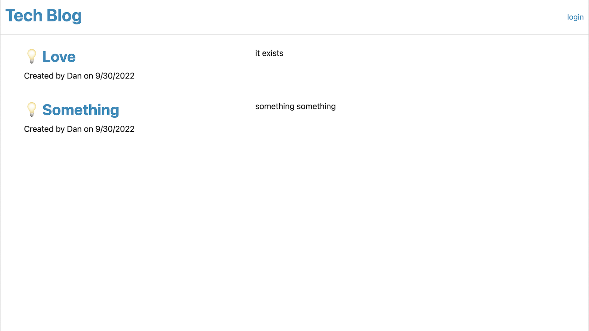

# Tech Blog

This application is a tech blog that allows you to create posts through your account that you can create. It uses Handlebars.js as the templating language, Sequelize as the Object-Relational Mapping tool, and npm as the package manager.

Link to the deployed application: https://danto-techblog-hw14.herokuapp.com/